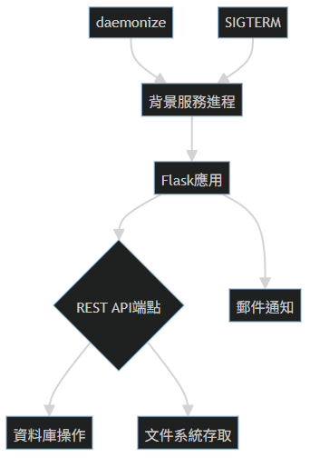

以下為程式碼片段的結構化解析：

### 原始程式碼整理
```python
from daemon import daemonize
from signal import SIGTERM 
from os import listdir 
from flask import Flask, jsonify, request, make_response, redirect 
from flask_restful import Resource, Api
from flask_mail import Mail, Message
```

### 模組功能說明
1. **daemonize** \[進程管理\]
   - 用途：將程式轉為後台守護進程(daemon)
   - 場景：讓服務在系統背景持續運行
   - 技術細節：處理UNIX雙fork流程，脫離終端控制

2. **SIGTERM** \[信號處理\]
   - 用途：接收系統終止信號(15號信號)
   - 搭配應用：實現優雅關機機制
   ```python
   import signal
   signal.signal(signal.SIGTERM, cleanup_handler)  # 註冊清理函式
   ```

3. **listdir** \[文件系統操作\]
   - 功能：列出指定目錄下所有檔案
   - 安全隱患：需注意路徑遍歷攻擊防範
   ```python
   # 範例：安全使用方式
   restricted_dir = '/var/api/uploads'
   files = listdir(restricted_dir)  # 限制在指定目錄
   ```

4. **Flask核心組件** \[Web框架\]
   - `Flask`：建立WSGI應用實例
   - `jsonify`：生成符合RFC 8259標準的JSON響應
   - `request`：解析HTTP請求數據
   - `make_response`：自定義響應對象
   - `redirect`：實現301/302重定向

5. **flask_restful** \[REST API開發\]
   - `Resource`：定義API端點的類基礎
   - `Api`：路由註冊管理器
   ```python
   class DataEndpoint(Resource):
       def get(self):
           return {'data': query_database()}
   api.add_resource(DataEndpoint, '/api/data')
   ```

6. **flask_mail** \[郵件服務\]
   - `Mail`：SMTP連接管理器
   - `Message`：郵件封裝對象
   ```python
   mail = Mail(app)
   msg = Message('系統通知', recipients=['admin@company.com'])
   msg.body = '資料庫存取異常'
   mail.send(msg)
   ```

### 架構關聯圖

````artifact
id: architecture
name: 模組協作架構
type: mermaid
content: |-
  graph TD
    A[daemonize] --> B[背景服務進程]
    B --> C[Flask應用]
    C --> D{REST API端點}
    D --> E[資料庫操作]
    D --> F[文件系統存取]
    C --> G[郵件通知]
    H[SIGTERM] --> B
````

### 安全注意事項
1. 使用`daemonize`時需配置：
   - PID文件鎖定
   - 標準輸入輸出重定向
2. `listdir`應配合：
   - 路徑白名單驗證
   - 檔案類型過濾
3. REST API必須包含：
   - JWT驗證中間件
   - 請求速率限制
4. 郵件發送需：
   - 採用TLS加密
   - 敏感資訊脫敏處理

建議補充防禦性程式碼，如對`listdir`的參數進行正規化處理：
```python
from pathlib import Path
def safe_listdir(base_path, sub_path):
    full_path = Path(base_path).resolve() / sub_path
    if full_path.parent != Path(base_path).resolve():
        raise SecurityError("路徑越界")
    return listdir(full_path)
```